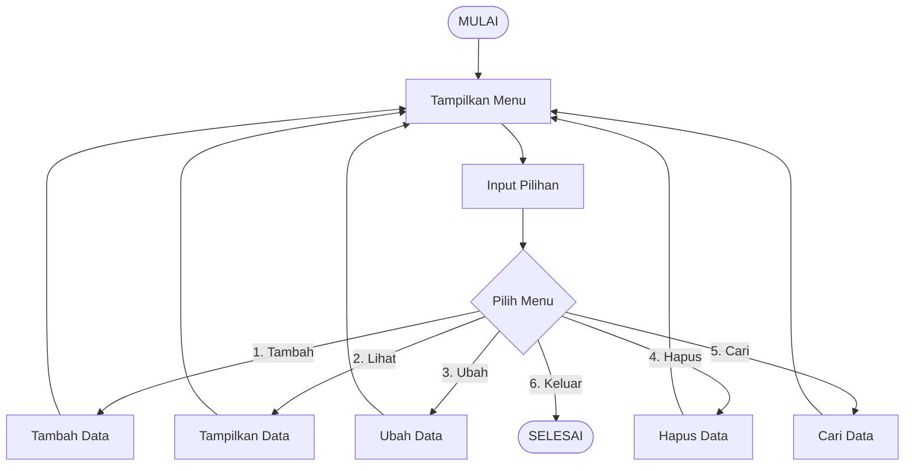

# 🧼 Sistem Manajemen Jasa Cuci Sepatu

## 📌 Deskripsi Singkat

**Sistem Manajemen Jasa Cuci Sepatu** merupakan program berbasis Java yang dibuat untuk membantu mengelola proses jasa cuci sepatu secara sederhana.
Program ini dapat digunakan untuk mengelola data pelanggan, data sepatu, serta transaksi jasa cuci sepatu. Program menerapkan konsep dasar **Pemrograman Berorientasi Objek (PBO)** dan memiliki fitur CRUD (*Create, Read, Update, Delete*).

Program dibuat menggunakan **Java** dan dikembangkan menggunakan **NetBeans**.

---

## 🎯 Tujuan Program

Program ini dibuat untuk:

- Mempermudah pengelolaan data pelanggan.
- Menyimpan informasi sepatu pelanggan.
- Mencatat transaksi jasa cuci sepatu.
- Mengelola status proses pencucian.
- Menerapkan konsep dasar Pemrograman Berorientasi Objek.

---

## ✨ Fitur Program

Program memiliki beberapa menu utama:

### 1. ➕ Tambah Data
Digunakan untuk menambahkan data pelanggan, sepatu, dan transaksi jasa cuci sepatu.

### 2. 📋 Lihat Data
Digunakan untuk menampilkan seluruh data transaksi yang telah tersimpan.

### 3. ✏️ Ubah Data
Digunakan untuk mengubah data tertentu pada transaksi, seperti nama pelanggan, nomor telepon, jenis layanan, dan status transaksi.

### 4. 🗑️ Hapus Data
Digunakan untuk menghapus data transaksi berdasarkan ID transaksi.

### 5. 🔎 Cari Data
Digunakan untuk mencari data transaksi berdasarkan ID transaksi.

### 6. 🚪 Keluar
Digunakan untuk keluar dari program.

---

## 🏗️ Struktur Class

Program terdiri dari **3 class entitas** dan **1 class entry point**.

### 👤 Pelanggan

Class `Pelanggan` digunakan untuk menyimpan informasi pelanggan.

Atribut:
- `idPelanggan`
- `nama`
- `noTelepon`
- `alamat`

### 👟 Sepatu

Class `Sepatu` digunakan untuk menyimpan informasi sepatu pelanggan.

Atribut:
- `idSepatu`
- `merek`
- `jenis`
- `warna`

### 🧾 Transaksi

Class `Transaksi` digunakan untuk menyimpan informasi transaksi jasa cuci sepatu.

Atribut:
- `idTransaksi`
- `pelanggan`
- `sepatu`
- `jenisLayanan`
- `harga`
- `status`

### ▶️ Minpro1JasaCuciSepatu

Class `Minpro1JasaCuciSepatu` merupakan **entry point** program.

Class ini digunakan untuk:
- Menampilkan menu.
- Menerima input pengguna.
- Menjalankan proses CRUD.
- Mengelola `ArrayList`.
- Mengatur alur program.

---

## 🔄 Alur Program

Alur program dimulai dengan menampilkan menu utama kepada pengguna.
## 🔄 Alur Program

      CRUD                Selesai
          │
          ▼
     Kembali ke Menu
          │
          └───────────────↺
